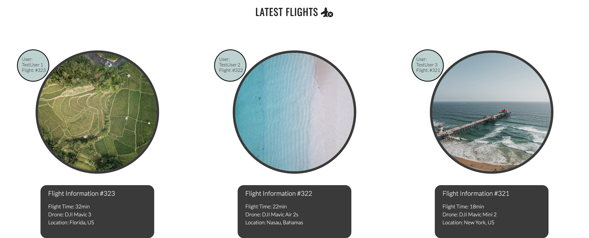

  

  <h3 align="center">Project 1 - Drone Flyers</h3>

  

    My first HTML/CSS project for CI. A website for drone enthusiasts that wants to share flights, pictures and stay in touch!
     
     
    <a href="https://bjorne90.github.io/project1-drones/index.html">View Website</a>
  

# Project 1 - Drone Flyers

This is a website that is basically built on HTML and CSS. The site's purpose is to gather drone enthusiasts to share photos with each other, their flights and have contact with each other.

The users' photos can be seen by anyone who visits the page, as well as visitors can see the users' flights.

## Features 

The page includes features that I list below. I have chosen these functions as a start on the page, I also note below which functions I want on the page.

### Existing Features

- __Navigation Bar__

The Drone Flying website is a one-page website, which means all of our content is accessible from the main navigation bar. Here's a quick overview of what you'll find:

- **Home:** Our start on the website.
- **About Us:** Section where there is more information about us.
- **Images:** Our gallery with the latest images from our members.
- **Latest Flights:** Section that shows our members latest submited flights with information and images.
- **Sign Up:** A sign up form to become a member of Drone Flyers.

- __Landing Image Section__

  - The landing page hero image that is a photo of a drone, with a circle with text that recomends you to sign up. 

- __About Us Section__

  - The About Us section is there because I want to simply tell you what the page does and why it exists.
  - The picture next to the text is there to make it a better experience for the visitor.

- __Gallery / Latest Images Section__

  - This section is for displaying pictures that our members have taken for visitors to the website.
  - This section will be updated every time our members upload images.

- __Latest Flights Section__ 

  - This section is for members who want to share their latest flights with visitors.
  - There must be a picture with each time to symbolize where you flew.

- __Sign Up Section__

  - The Sign Up form is there in case someone wants to become a member and share photos and flights.
  - After clicking submit, the user is forwarded to a "Thank You" page. 

- __Footer section__

  - Footer contains copyright information and links to Facebook, YouTube and Instagram. There is also a mailto: that goes to my email. 

Navbar and footer are fixed and follow when scrolling.

### Features Left to Implement

- Login page for members
- Posibility to download images
- Member page

## Testing 

* The website has been tested in several different browsers such as Chrome, Safari and Firefox.

* I have tested that the page is responsive via Chrome devtools and via an Ipad.

* I have checked that the text is readable, that it is accessible to users.

* I have tested the form several times that it really works as intended and that all fields must be filled in.

### Validator Testing 

- HTML
  - No errors were returned when passing through the official [W3C validator](https://validator.w3.org/nu/?doc=https%3A%2F%2Fcode-institute-org.github.io%2Flove-running-2.0%2Findex.html)
- CSS
  - No errors were found when passing through the official [(Jigsaw) validator](https://jigsaw.w3.org/css-validator/validator?uri=https%3A%2F%2Fvalidator.w3.org%2Fnu%2F%3Fdoc%3Dhttps%253A%252F%252Fcode-institute-org.github.io%252Flove-running-2.0%252Findex.html&profile=css3svg&usermedium=all&warning=1&vextwarning=&lang=en#css)

- Accessibility
  - No errors were returned when passing through the official  

### Unfixed Bugs

I have checked the code and have not found any current bugs. I have fixed the bugs I have previously found.

## Deployment 

- The site was deployed to GitHub pages. The steps to deploy are as follows: 
  - In the GitHub repository, navigate to the Settings tab 
  - From the source section drop-down menu, select the Master Branch
  - Once the master branch has been selected, the page will be automatically refreshed with a detailed ribbon display to indicate the successful deployment. 

The live link can be found here - https://bjorne90.github.io/project1-drones/index.html

## Credits  

### Content 

- I was helped by Google translate for the translation of some words.
- The icons were taken from [Font Awesome](https://fontawesome.com/)

### Media

- All photos on the website are from [Pexels](https://www.pexels.com/sv-se/)
- The images are free stock photos.